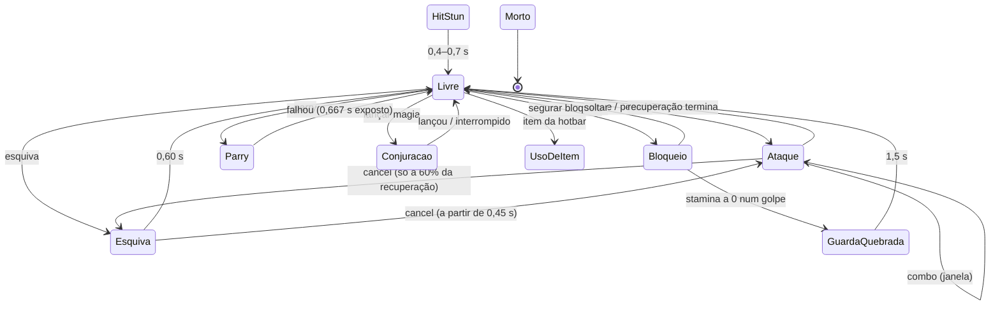

# 01 — Combate

O núcleo do jogo. É aqui que o pilar "habilidade acima de nível" vive ou morre.

> **WP1 · reescrito pelo Fable** (31-07-2026). Tudo o que era `[EM ABERTO]` neste documento tem agora um número. **Todos os números são pontos de partida `[FABLE]`**, escritos para o protótipo de combate os validar (marco 2 do plano de construção, WP15) — o que o protótipo desmentir, volta aqui e muda-se **neste documento primeiro**. Fronteira com o WP1B (`spec/25-controlo.md`, do Claude): este documento define **o que as acções fazem e quando**; o WP1B define **como se sentem** — câmara, guarda de entrada (*input buffer*), orçamento de latência, paragem de impacto. Nada aqui duplica isso.

## O que eles decidiram

| Elemento | Estado | Timestamp |
|---|---|---|
| Corpo a corpo com espada | `[DECIDIDO]` | 00:16 |
| Escudo | `[DECIDIDO]` | 00:16 |
| Arco e flecha (distância) | `[DECIDIDO]` | 00:16 |
| Magia como forma de combate | `[DECIDIDO]` | 00:16 |
| **Esquiva** | `[DECIDIDO]` | 02:04 |
| **Parry** | `[DECIDIDO]` — "no combate corpo a corpo e tal" (Rico, 02:11) | 02:04, 02:11 |
| Stamina como recurso | `[DECIDIDO]` — aparece como atributo a subir | 03:50, 06:33 |

> "Esquiva, esse bagulho tem que ter também, né? Esquiva, bagulho de parry." — Mateus (02:04)

Nada abaixo contradiz uma linha desta tabela. Tudo abaixo é a tabela transformada em números.

## Convenções

- **60 fps de referência** (o tecto das duas máquinas — pergunta 0). Tempos em segundos e frames: `0,60 s (36 f)`.
- **Frames de um ataque:** `arranque / activo / recuperação` — o golpe só acerta nos frames activos.
- **MV (valor de movimento):** multiplicador de dano do golpe. A interface com o WP2 é: `dano = MV × dano_base_da_arma × escala_de_atributos − defesa`. O WP1 fixa os MV; o WP2 fixa o resto da fórmula.
- **Cancelável:** a animação pode ser cortada por outra acção no intervalo dito. Fora desses intervalos, o compromisso é total — é isso que dá peso às escolhas.

## A máquina de estados

**Prioridade de interrupção** (o que corta o quê): Morte > Cambaleio/GuardaQuebrada > HitStun > tudo o resto. Levar dano interrompe qualquer acção — **excepto** nas janelas de invencibilidade (esquiva, riposte) e de hiper-armadura (pesado do machadão, Égide). O jogador nunca fica "preso" num estado por mais de 1,5 s.

## Movimento

| Modo | Velocidade | Custo | Notas |
|---|---|---|---|
| Andar | 3,0 m/s | 0 | sempre disponível, mesmo exausto |
| Correr | 5,0 m/s | 0 | o passo por defeito |
| Sprint | 7,0 m/s | 8 stamina/s | mantém o lock-on |
| Strafe (com lock-on) | 4,0 m/s | 0 | lateral e para trás |
| Conjuração | 40% do modo actual | — | ver "Combate à distância" |

*Teste da Lei 1:* correr é grátis e mais rápido do que qualquer inimigo comum em patrulha (WP6 herda isto como tecto de velocidade). **Fugir nunca depende de estatísticas** — um jogador em apuros sai sempre a andar. ✅

## Esquiva (rolamento)

| Parâmetro | Valor |
|---|---|
| Duração total | **0,60 s (36 f)** |
| Invencibilidade | **0,08 s → 0,38 s** (frames 5–23 · **300 ms**) |
| Custo | **25 stamina** |
| Distância | **3,5 m**, 8 direcções (sem direcção: para trás) |
| Recuperação vulnerável | 0,38 s → 0,60 s |
| Cancelável | a partir de 0,45 s, em: ataque leve · bloqueio · nova esquiva |

Sem variação por peso de equipamento na fatia 1 — não há armadura (pergunta 14). Se armadura entrar, o rolamento ganha classes de peso **neste documento**, não lá.

*Teste da Lei 1:* 300 ms de invencibilidade cobrem qualquer ataque telegrafado do jogo — o WP6 fica obrigado a ≥ 0,5 s de aviso legível em todo o ataque inimigo. A esquiva não escala com nível: o jogador de nível 1 tem exactamente os mesmos 300 ms que o de nível 100. O nível compra stamina (mais esquivas), nunca esquivas melhores — margem de erro, não porta. ✅

## Parry

**Quem apara:** o **escudo** e a **adaga** `[FABLE]`. Espada, machadão e cajado não aparam. *Razão:* dá identidade às armas dentro da Lei 3 — o bloqueio é a defesa "segura" do escudo, o parry da adaga é a defesa de risco do Assassino, o machadão troca defesa por hiper-armadura. *Alternativa descartada:* parry universal — dilui a identidade das armas e obriga a equilibrar cinco janelas em vez de duas.

| Parâmetro | Valor |
|---|---|
| Arranque | 4 f (0,067 s) |
| **Janela activa** | **8 f (0,133 s)** |
| Falhou | 40 f (0,667 s) exposto, sem defesa |
| Custo | 10 stamina (na tentativa, acerte ou falhe) |
| Acertou | golpe anulado (0 dano, 0 stamina) → atacante em **Postura Quebrada** 2,0 s |
| Riposte | primeiro golpe sobre Postura Quebrada: **MV 2,5**, animação 0,9 s **com invencibilidade** |

**O que se apara:** o WP6 marca cada ataque inimigo como `aparável` ou `só esquiva` (projécteis grandes, agarrões e pancadas de área não se aparam — a esquiva cobre-os). O brutamontes é o professor: todos os golpes dele são aparáveis e lentos.

*Teste da Lei 1:* risco e recompensa puros — 133 ms de janela contra 667 ms de castigo. Não escala com nada: o parry do nível 1 é o parry do nível 100. Um jogador excelente mata o Vorgar à base de parry sem gastar um ponto. A janela é generosa de propósito no arranque (Dark Souls anda pelos 100–167 ms); **aperta-se no protótipo se for trivial** — nunca por nível. ✅

## Bloqueio

| Situação | Absorção | Custo de stamina |
|---|---|---|
| Escudo vs físico | **100%** | 15 × peso do golpe (leve 1,0 · pesado 1,8) |
| Escudo vs magia | 50% | idem |
| Arma de uma mão (sem escudo) | 50% | ×1,5 |
| Machadão / cajado (duas mãos) | não bloqueiam | — |

- Regeneração **enquanto bloqueia: 10/s** (25% da normal).
- **Guarda Quebrada:** stamina chega a 0 a absorver um golpe → cambaleio de **1,5 s**, exposto a riposte como na Postura Quebrada. É o castigo de bloquear tudo — o escudo é seguro, não é grátis.

*Teste da Lei 1:* o Tanque de nível 1 bloqueia o mesmo que o de nível 50 — o nível compra a stamina que aguenta mais golpes, não a absorção. E a Guarda Quebrada garante que "segurar RMB" nunca é resposta completa: bloquear sem ler o inimigo acaba em cambaleio. ✅

## Stamina

| Parâmetro | Valor |
|---|---|
| Base (nível 1) | **100** — a escala por atributo é do WP2 |
| Regeneração | **40/s**, após **0,8 s** sem gastar |
| A bloquear | 10/s |
| A zero | sem acções ofensivas/defensivas até recuperar **15** (histerese); andar e correr sempre possíveis; sprint não |

Custos, todos num sítio: esquiva 25 · parry 10 · sprint 8/s · bloqueio por golpe (tabela acima) · ataques (tabela abaixo). Magia gasta **cargas**, não stamina (03:50) — dois recursos, duas decisões.

*Teste da Lei 1:* a zero, o jogador nunca fica indefeso de facto — anda, corre, cria distância, e 0,8 s + 15 de histerese devolvem-lhe a esquiva em ~1,2 s. Exaustão pune a ganância; não executa ninguém. ✅

## Ataques — as armas da fatia

Frames `arranque/activo/recuperação` a 60 fps. Combo: número máximo de leves encadeados (a janela de encadear abre nos últimos 40% da recuperação).

| Arma | Leve | Custo | MV | Pesado | Custo | MV | Combo | Alcance | Fatia 1? |
|---|---|---|---|---|---|---|---|---|---|
| **Adaga** | 12/4/14 (0,50 s) | 12 | 0,55 | 20/5/20 (0,75 s) | 20 | 0,85 | ×4 (4.º: MV 0,7) | 1,4 m | ✅ |
| **Espada longa** | 16/6/18 (0,67 s) | 18 | 1,0 | 28/8/26 (1,03 s) | 30 | 1,6 | ×3 (3.º: MV 1,2) | 2,0 m | ✅ |
| **Machadão** | 24/8/26 (0,97 s) | 28 | 1,5 | 38/10/34 (1,37 s) | 45 | 2,4 | ×2 | 2,3 m | ✅ |
| **Cajado (pancada)** | 18/5/20 (0,72 s) | 15 | 0,7 | 30/7/28 (1,08 s) | 25 | 1,1 | ×2 | 1,8 m | ✅ |
| **Escudo (bash)** | 14/4/16 (0,57 s) | 15 | 0,4 — postura ×2 | — | — | — | — | 1,2 m | ✅ |
| Arco | ver "Combate à distância" | | | | | | | | ⬜ fatia 2 |

Regras transversais:

- **Pesado do machadão é carregável:** segurar até +20 f → MV 3,0. **Hiper-armadura do frame 30 até ao fim dos frames activos** — no golpe carregado, prolonga-se com ele (o protótipo apanhou que "frames 30–48" à letra deixava o carregado desprotegido no momento do impacto). Leva o dano, não é interrompido. É a identidade do Berserker dentro da Lei 3.
- **Cancelamentos:** a recuperação de um **leve** é cancelável em esquiva ou bloqueio a partir de 60% dela. O **pesado** não se cancela — compromisso total (o carregado do machadão pode soltar cedo). Ataque nunca cancela ataque fora da janela de combo.
- **Duas mãos:** machadão e cajado ocupam as duas; **adaga e espada** combinam com escudo na outra. (Corrige a contradição que o protótipo apanhou: o cajado estava listado nos dois lados; vale a tabela de bloqueio — cajado é a duas mãos e não bloqueia, coerente com a ficha do Feiticeiro no WP3.)

*Teste da Lei 1 — e a restrição que o WP2 herda:* com atributos de nível 1 e zero pontos, a curva de dano do WP2 **tem de satisfazer**: orc lanceiro morre em 3–5 leves de espada; brutamontes em 6–9; Vorgar em 45–70. Se o WP2 produzir números fora disto, está errado o WP2 — o chefe passa a testar paciência. Fica escrito aqui para o teste jogado do critério 3 da fatia (nível 1, zero pontos, mata o Vorgar) ter chão. ✅

## Poise e interrupção

- **Jogador: poise zero por defeito.** Qualquer dano interrompe (HitStun 0,4 s golpe leve · 0,7 s pesado). Excepções: i-frames (esquiva, riposte) e hiper-armadura (machadão pesado; Égide — WP4).
- **Inimigos: postura 0–100** (valor por inimigo no WP6). Dano de postura por golpe = `MV × 10`; bash de escudo ×2; parry acertado = quebra imediata. A 0 → **Cambaleio 1,2 s** e a postura volta ao máximo.

*Teste da Lei 1:* a postura premeia agressão com leitura — quebrar um inimigo é habilidade acumulada, não estatística. E o jogador sem poise significa que nível nenhum o deixa ignorar golpes: até ao 100, levar dano continua a custar o turno. ✅

## Lock-on

**Existe.** `[FABLE]` *Razão:* esquiva direccional e parry vivem de duelo legível; e em co-op os dois precisam de saber quem tem a atenção de quem. *Alternativa descartada:* mira livre pura — funciona com rato, mas parte a leitura de duelos e obriga cada golpe a ser um julgamento de mira, que não é o jogo que eles descreveram.

| Parâmetro | Valor |
|---|---|
| Alcance de engate | 18 m, com linha de vista |
| Quebra | > 25 m, ou 1,5 s sem linha de vista, ou alvo morto |
| Trocar de alvo | flick do rato / stick direito |
| Movimento | strafe 4,0 m/s; esquiva 8-direccional; sprint mantém o lock |

Ao quebrar por morte do alvo, **não re-engata sozinho** — re-engatar é decisão do jogador (evita a câmara a saltar para o parceiro ou para o inimigo errado no meio de um combo). O enquadramento, a rotação e o caso "chefe em cima do jogador" são do **WP1B**.

## Combate à distância — o problema do género, resolvido no sistema

O risco conhecido ([`00-visao.md`](00-visao.md)): se atacar de longe for seguro, ninguém esquiva nem apara, e as duas mecânicas centrais morrem. A resposta não é proibir a distância — é fazê-la **cara, lenta e interrompível**:

1. **Magia gasta cargas** (03:50, decidido por eles) — o recurso não regenera em combate (recuperação: WP4/WP5, com o modelo de descanso da pergunta 7).
2. **Conjurar trava o movimento a 40%** e tem tempo de lançamento por magia (pontos de partida no WP4: Dardo 0,8 s · Ruína 1,6 s · Égide 0,5 s).
3. **Levar dano durante a conjuração interrompe e gasta a carga.** `[FABLE]` *Razão:* conjurar na cara de um inimigo tem de ser uma aposta, senão a magia vira spam-até-sair. *Alternativa descartada:* interromper sem gastar — mais simpática, mas remove o único custo de conjurar mal.
4. **Anti-kite:** um inimigo que passe **4 s** sem conseguir alcançar o alvo ganha comportamento de fecho — sprint, salto, projéctil próprio (o WP6 implementa por inimigo; o lanceiro é o primeiro).
5. **O plano B do mago é o cajado** — pancada sem custo nenhum (tabela acima). Sem cargas, o Feiticeiro é um lutador fraco mas inteiro: esquiva, apara com escudo se o tiver, e bate. **A Lei 1 nunca fica refém do contador de cargas.**

**Arco (fatia 2), regras desde já** para o WP5 herdar: puxar 0,9 s para dano pleno (50% aos 0,45 s) · movimento a 30% enquanto puxa · aljava de 15 · ~70% das setas recuperáveis dos corpos · sem i-frames a disparar. O Batedor entra quando isto entrar.

*Teste da Lei 1:* a distância continua a ser opção a sério (a Ruína muda salas inteiras), mas nunca é a opção **segura** — o jogo empurra sempre de volta para a dança da esquiva e do parry, que é onde a habilidade vive. ✅

## Morte

Formaliza o provisório da fatia 1 ([`10-fatia-1.md`](10-fatia-1.md)):

- Renasces na **entrada de Brumal**; depois de descoberta, a **boca da Toca** é o ponto de renascimento (descobrir = checkpoint, sem fogueira nem menu).
- ⚠️ **ACTUALIZADO 31-07:** ~~não se perde nada~~ → **perdem-se as almas**, que ficam no sítio onde se morreu. Ver [`33-morte-e-almas.md`](33-morte-e-almas.md), que substitui esta linha. Vida, stamina e cargas continuam restauradas; inimigos normais renascem; o chefe faz reset total.
- Morrer no Vorgar → nova tentativa em **< 30 s**, também em co-op (critério 4 da fatia).
- ⚠️ **ACTUALIZADO 31-07:** em co-op o jogador morto **pode ser ressuscitado** — 1 minuto de janela, o parceiro fica 5 s em cima do corpo. Ver [`33-morte-e-almas.md`](33-morte-e-almas.md) §4, que substitui o provisório de que um jogador morto (chefe: até a tentativa acabar; mundo: até o parceiro sair de combate) e renasce ao lado do parceiro. `[FABLE]` *Razão:* reviver a meio do chefe transformava o ×1,8 de vida em corrida de revezamento. *Alternativa descartada:* ressuscitar o parceiro no local — é a pergunta certa para o WP10 revisitar com a rede à frente.

A **pergunta 10** (perde-se alguma coisa ao morrer — o tom do jogo) **continua deles**. Quando decidirem, muda aqui e o resto da spec herda.

## Comandos

Nenhuma das duas máquinas tem comando (pergunta 0) — **teclado+rato é o esquema primário**; o de comando fica como referência para quando existir um.

| Acção | Teclado+rato | Comando (referência) |
|---|---|---|
| Mover | WASD | stick esquerdo |
| Câmara | rato | stick direito |
| Ataque leve | LMB | RB |
| Ataque pesado | Shift+LMB | RT |
| Bloqueio (segurar) | RMB | LB |
| Parry | Q | LT |
| Esquiva / Sprint | Space toque / segurar | B toque / segurar |
| Lock-on | Tab | RS click |
| Magia seguinte | F | seta ↑ |
| Usar item activo | R | X |
| Hotbar | 1–5 | seta ↓ (ciclo) |
| Interagir | E | A |
| Conjurar a magia activa | C | Y |
| Bash de escudo | LMB com bloqueio activo | RB com LB activo |
| Andar (lento, 3,0 m/s) | Ctrl (segurar) | inclinação leve do stick |

As três últimas linhas vieram do protótipo `[FABLE]` — a tabela original não dava botão a conjurar, ao bash nem ao andar (o teclado não tem analógico).

> ⚠️ **Divergência aberta com o WP1B:** este documento põe o parry em `Q`; o [`25-controlo.md`](25-controlo.md) propõe parry no *toque* de `RMB` (bloqueio no *segurar*). São filosofias diferentes — botão dedicado vs uma só tecla de defesa — e o próprio WP1B avisa que a escolha contamina os testes da Lei 1. **Não se decide no papel: o protótipo tem de testar as duas cedo**, e o resultado fecha as duas specs ao mesmo tempo.

Sensibilidade, remapeamento e afinação são do **WP1B/WP11** — isto é o mapa por defeito.

## O que este documento entrega aos outros

| Para | O quê |
|---|---|
| **WP2** | os MV de todas as armas; a fórmula `MV × base × escala − defesa`; as restrições de golpes-para-matar a nível 1 (secção Ataques) |
| **WP1B** | as janelas em frames que o buffer e a latência têm de servir; a lista de estados canceláveis |
| **WP6** | ≥ 0,5 s de aviso legível em todo o ataque; a marca `aparável`/`só esquiva` por ataque; postura por inimigo; anti-kite aos 4 s; velocidade de patrulha < 5,0 m/s |
| **WP7** | o sistema de postura e o riposte; o reset total do chefe na morte; o ×1,8 em co-op (da fatia 1) |
| **WP4** | tempos de conjuração de partida; a regra interrupção-gasta-carga; hiper-armadura da Égide |
| **WP15** | o **marco 2** valida cada número deste documento no protótipo — um boneco, três inimigos, as cinco armas |

## O que continua aberto

- **Pergunta 10** — o tom da morte (perder algo?). Deles.
- **Pergunta 20** — fogo amigo. Decide-se no WP10 com a rede à frente.
- **Todos os números deste documento** fecham no protótipo do marco 2. Até lá são `[FABLE]`, com esta ordem de confiança: janelas de esquiva/parry (alta — vêm da gramática do género), frames por arma (média), custos de stamina (média), restrições de golpes-para-matar (baixa — dependem do WP2).
